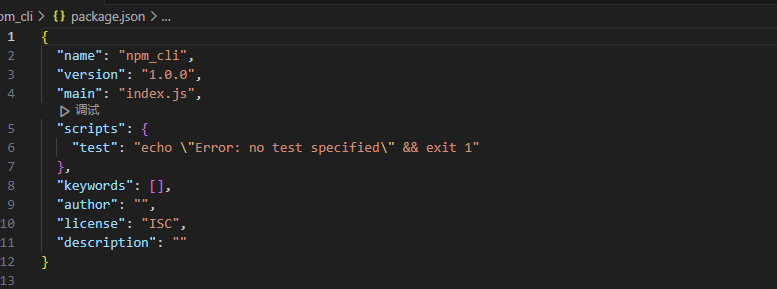
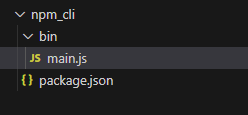
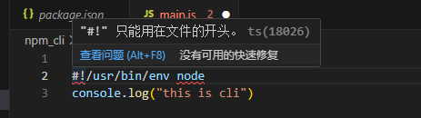
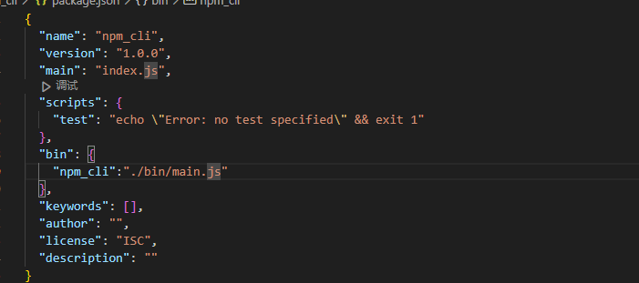
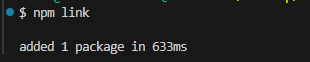
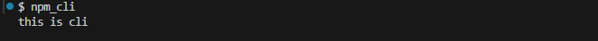

# 为什么想写一个脚手架？
做开发已经三年了，其实很早之前就开始想这个问题，一开始只是纯粹想造一个Cli，作为自己技术的体现，也没有什么太多的想法，但是后来作为一名独立开发者，参与了两到三家小公司前端的独立开发，经常需要从零到一搭建项目，所以常常需要利用脚手架创建项目，在搭建项目时，发现一个项目的搭建的前期准备不仅仅是利用cli或者其他脚手架创建完项目就可以使用，往往还伴随着其他的一些工具库，例如：vite 搭建 VUE+TS项目，创建完毕以后，往往还需要添加Pinia、vue-Router、 axios这些第三方库，以及基于这些库封装的一些组件或者方法和不完善的目录结构，所以常常就在想，自己是否能在基于现代Vite的基础之上逐步完善一个通用的、符合大多数的并且解决以上痛点的脚手架(其实简单来说就想写一个基于vite进一步封装的脚手架，以满足自己再写新项目时，提高开发效率，增加自己摸鱼的时间)。
# 起步
## 写一个简单的cli 添加到本地全局npm中
### 前提：
你的电脑必须安装了node和npm

1. 首选你需要创建一个文件作为脚手架的目录 
```bash
 mkdir npm_cli

 cd npm_cli
```
2. 接着你需要对这个文件夹进行npm或者其他你喜欢并且在你本地安装包 进行初始化
```bash
npm init -y 
```
3. 你会得到一个文件(也许需要你提前指定一些内容，不过后面我们也可以进行修改)：package.json  
 

4. 接着我们创建一个名为bin的文件夹 并在文件夹创建一个名为 mian的js文件


5. 接着我们在main.js文件中写这样一句话
```js
#!/usr/bin/env node  //这句话是告诉系统 需要用nodejs来执行这个文件 这是必须的

console.log("this is cli")
```
 #### 注意：你必须将这句话写在第一行
   

6. 保存后我们打开package.json  在全局对象内创建一个 bin对象 指定一个属性名（这个属性名就是你需要执行的命令行）  属性值为你创建的main文件的相对路径 

7. 接着在bash或者命令窗口执行以下命令：
```bash
npm link
```
一般出现下面这种或者 没有报错就说明执行成功了

8. 接着需要你执行我们之前写的命令（还记得步骤6中的我们指定的属性名吗？）
```bash
npm_cli
```


这时候控制台就可以输出我们之前写的代码，

### 恭喜你，你已经完成一个简单的cli脚手架了！！！ 后面关于脚手架的一切基本上都是基于我们今天学到的知识拓展而来的。

