# 什么是HTTP HTTP和HTTPS有什么区别?

## HTTP
HTTP（超文本传输协议）是实现网络通信的一种规范

在计算机和网络世界中，存在不同的协议，如 广播协议、寻址协议、路由协议等等.....

而HTTP是一个传输协议，即将数据由A传输到B或将B传输到A，并且A与B之间可以存在很多第三方：A<=>C<=>D<=>E<=>F<=>B

传输的数据并不是计算机底层中的的二进制包，而是完整的，有意义的数据，如HTML文件、图片文件，查询结果等超文本，能够被上层应用识别

在实际应用中，HTTP常用于再被web浏览器和网站服务器之间传递信息，以明文的方式发送内容，不提供任何方式的数据加密

特点如下：
- 支持客户/服务器模式
- 简单快速：客户向服务器请求服务时，只需要传送请求方法和路径。由于HTTP协议简单，使得HTTP服务其规模小，因而通信速度快
- 灵活：HTTP允许传输任意类型的数据对象，正在传输的类型由Content-Type加以标记
- 无连接：无连接的含义是限制每一次链接只能处理一个请求，服务器处理完客户端的请求，收到客户端的应答后，即断开连接，采用这种方式可以节省传输时间
- 无状态：HTTP协议无法根据之前的状态进行本次的请求处理
## HTTPS
HTTP是以明文传输内容的，这并不安全，而HTTP的出现正是为了解决这一问题的

为了保证这些隐私数据能够加密传输，让HTTP运行安全的SSL/TLS协议上。即HTTPS=HTTP+SSL/TLS，通过SSL证书来验证服务器的身份。并为浏览器和服务器之间的通信进行加密

SSL协议位于TCP/IP协议与各种应用层之间，浏览器在使用SSL建立链接时，需选择一组恰当的加密算法来实现安全通信，为数据通信提供安全支持

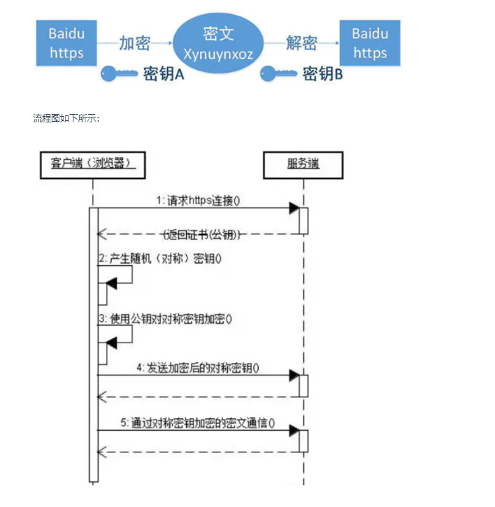

- 首先客户端通过URL的方式访问服务器建立SSL链接
- 服务端收到客户端的请求后，会将网站支持的证书信息（证书中包含公钥）传送一份给客户端
- 客户端的服务器开始协商SSL连接的安全等级，也就是加密信息的等级
- 客户端的浏览器根据双方同意的安全等级，建立会话秘钥，然后利用网站的公钥将会话秘钥加密，并传送给网站
- 服务器利用自己的私钥解密出会话秘钥
- 服务器利用会话秘钥加密与客户端之间的通信
## 区别
- HTTPS是HTTP协议的安全版本，HTTP协议的数据是明文传输的，是不安全的，HTTPS使用了SSL/TLS协议进行了加密处理，相对更安全
- HTTP和HTTPS使用的连接方式不同，默认端口也不一样，HTTP是 80端口，HTTPS是443
- HTTPS由于需要设计加密以及多次握手，性能方面不如HTTP
- HTTPS需要SSL证书,SSL证书需要钱，功能越强大的证书费用越高
  
# HTTPS的安全性
## HTTP存在的问题
- 通信使用明文（不加密），内容可能被窃听
- 不验证通信方的身份，因此有可能遭遇伪装

而HTTPS的出现正是解决这些问题，HTTPS是建立在SSL之上，其安全性由SSL来保证

在采用了SSL后，HTTP就拥有了HTTPS的加密、证书和完整性保护这些功能
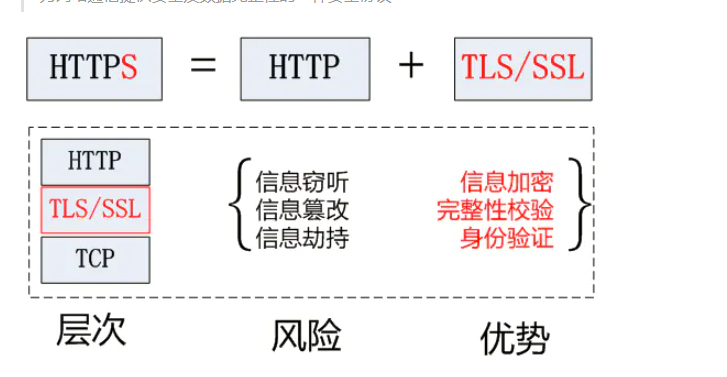

## SSL加密手段
SSL实现这些功能主要依赖于三种手段
- 对称加密：采用协商的秘钥对数据加密
- 非对称加密：实现身份认证和秘钥协商
- 摘要算法：验证信息的完整性
- 数字签名：身份验证

### 对称加密

对称加密指的是加密和解密使用的秘钥都是同一个，是对称的，只要保证了密钥的安全，那整个通信过程就可以说具有了机密性
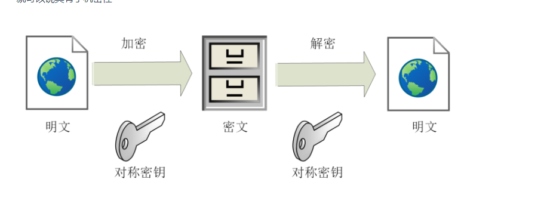

### 非对称加密
非对称加密存在两个秘钥，一个公钥，一个私钥，两个秘钥是不同的，公钥可以公开给任何人使用，私钥则需要保密

公钥和私钥都可以用来进行加密或解密，但公钥加密后只能使用私钥来进行解密，反过来，私钥加密后也只能使用公钥来进行解密

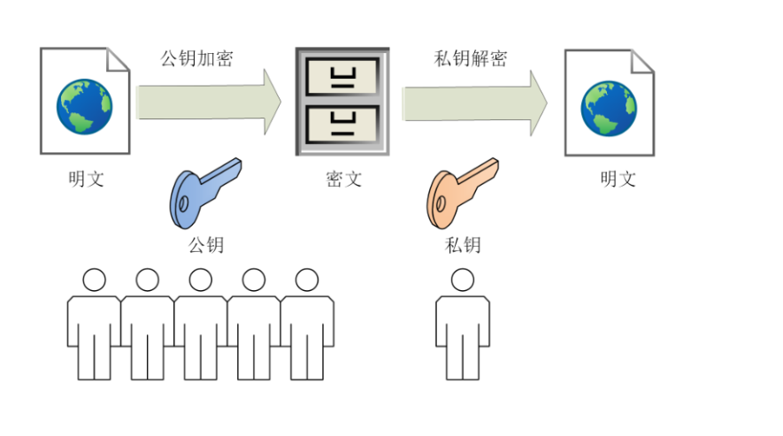


### 混合加密
在HTTPS通信过程中，采用的是对称加密+非对称加密，也就是混合加密

在对称加密中我们了解到如果能保证密钥的安全，那么整个通信阶段的安全性也就得到的保障

而HTTPS采用非对称加密解决秘钥交换的问题

具体做法是发送密文的一方使用对方的公钥进行加密处理“对称的秘钥”，然后对方用自己的私钥解密拿到“对称的秘钥”，然后对方用自己的私钥解密拿到“对称的秘钥”

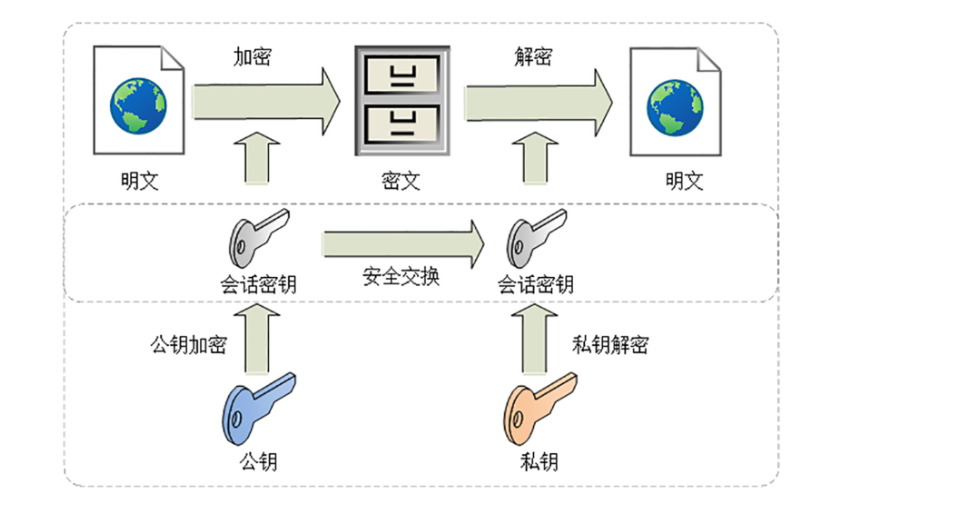

这样可以确保交换的秘钥是安全的前提下，使用对称加密的方式进行通信

### 摘要算法

实现完整性的手段主要是摘要算法，也就是常说的散列函数，哈希函数

可以理解成一种特殊的压缩算法，它能够把任意长度的数据压缩成固定长度、而且是独一无二的摘要字符串，就好像是给这段数据生成了一个数字“指纹”

摘要算法保证了“数字摘要”和原文是完全等价的。所以我们只需要在原文后附上他的摘要，就能够保证数据的完整性

### 数字签名

数字签名能确定消息确实由发送方签名并发送出来的，因为别人假冒不了发送方的签名

原理很简单，就是用私钥加密，公钥解密

签名和公钥一样完全公开，任何人都可以获取，但这个签名只有用私钥对应的公钥才能解开，拿到摘要后，再比对原文进行验证完整性，就可以像签署文件一样证明消息确实是你发的

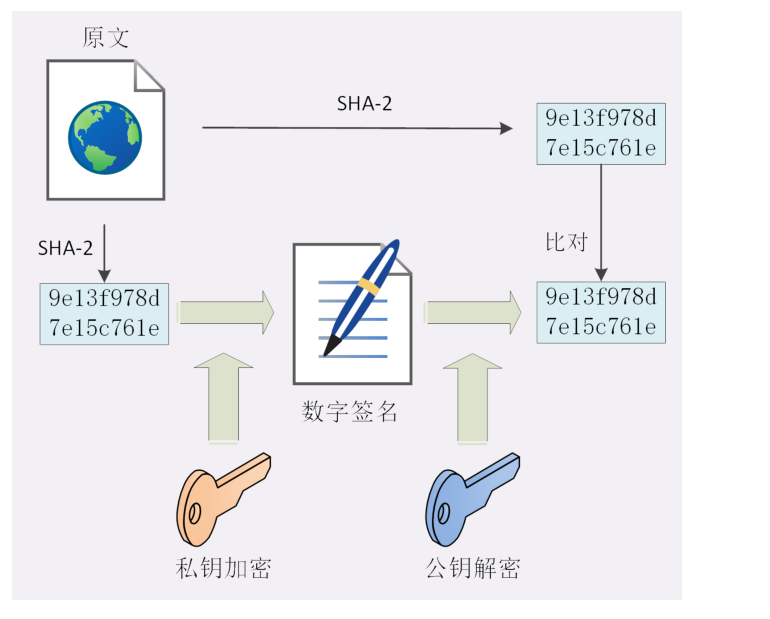

和消息本身一样，因为谁都可以发布公钥，我们还缺少防止黑客伪造公钥的手段，也就是说，如何判断这个公钥是你的公钥

这个时候就需要一个第三方，就是证书验证机构  

### CA验证机构

数字证书认证机构处于客户端与服务器双方都可信赖的第三方机构的立场

CA对公钥的签名认证要求包括：序列号、颁发者、有效时间等等，把这些打成一个包再签名，完整的证明公钥关联的各种信息，形成“数字证书”

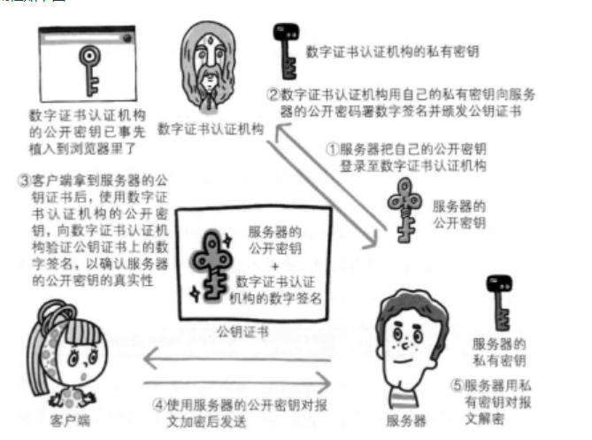

- 服务器的运营人员向数字证书机构提出公开秘钥的申请
- 证书机构在判明提出者的身份之后，会对已申请的公开密钥做数字签名
- 然后分配这个已签名的公开秘钥，并将该公开秘钥放入公钥证书后绑定在一起
- 服务器会将这份由数字证书认证机构颁发的数字证书发送给客户端，以进行非对称加密方式通信
  
  接到证书的客户端可使用数字证书认证机构的公开秘钥进行解密，对证书上的数字签名进行验证，一旦验证通过，则证明

- 认证服务器的公开秘钥是真实有效的数字证书认证机构
- 服务器的公开秘钥是值得信赖的

可以看到   HTTPS和HTTP虽然只差了一个SSL，但是通信安全得到了大大的保障，通信的四大特性都得到了解决，解决方式如下：

- 机密性：混合算法
- 完整性：摘要算法
- 身份认证：数字签名
- 不可否定：数字签名

同时引入第三方证书机构，确保公开秘钥的安全性

# UDP和TCP的区别以及应用场景

## UDP 
UDP（user Datagram Protocol） 用户数据包协议，是一个简单的面向数据报的通信协议，即对应用层叫下来的报文，不合并，不拆分，只是其上面加上首部后就交给了下面的网络层

也就是说无论应用层交给UDP多长的报文，它都只会是统统发送，一次发送一个报文

而对接收方，接到后直接去除首部，交给上面的应用层就完成任务

UDP报头包括四个字段，每个字段占用2个字节（即16个二进制位），标题短，开销少

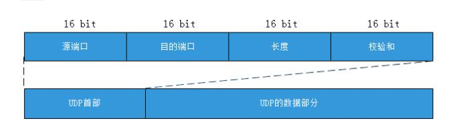

特点如下：

- UDP 不提供复杂的控制机制，利用IP提供面向无连接的通信服务
- 传输途中出现丢包，UDP也不负责重发
- 当包的到达顺序出现乱序时，UDP也没有纠正的功能
- 并且他是将应用程序发来的数据收到的那一刻，立即按照原样发送到网络上的一种机制。即使出现网络拥堵的情况，UDP也无法进行流量控制等避免网络拥塞行为

## TCP

TCP（Transmission Control ProtoCol），传输控制协议，是一种可靠、面向字节流的通信协议，把上面应用层交下来的的数据看成无结构的字节流来发送

可以想象成流水形式，发送放TCP会将数据放入“蓄水池”（缓存区），等到可以发送的时候就发送，不能发送就等着，TCP会根据当前网络的拥塞状态 来确定每个报文段的大小

TCP首部报文有20个字节，额外开销大
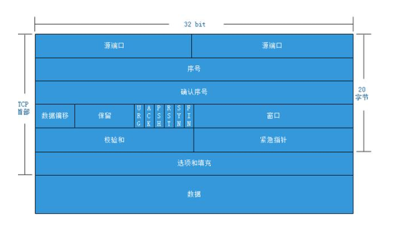

特点如下:

- TCP充分实现了数据传输时各种控制功能，可以进行丢包时的重发控制，还可以对次序乱掉的分包进行顺序控制。而这些在UDP中都没有。
- 此外，TCP作为一种面向有连接的协议，只有确定通信对端存在时才会发送数据，从而可以控制通信流量的浪费
- 根据TCP的这些机制，在IP这种无连接的网络上也能实现高可靠性的通信（主要通过检验序列号、确认应答、重发控制、连接管理以及窗口控制等机制实现）

## 区别

两者都位于传输层，

区别如下
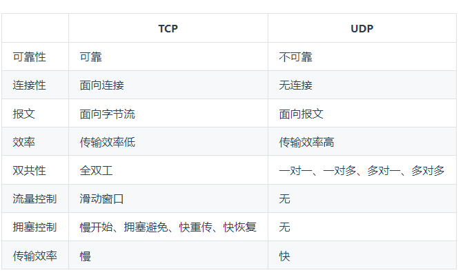

- TCP是面向连接的协议，建立连接三次握手，断开连接四次挥手。UDP是面向无连接的，数据传输前后不连接，发送端只负责将数据发送到网络，接收端从消息队列读取
- TCP提供可靠的服务，传输过程采用流量控制、编号与确认、计时器等手段确保数据无差错，不丢失。UDP则尽可能的传输数据，但不保证传递交付给对方
- TCP面向字节流，将应用层报文看成一串无结构的字节流，分解为多个TCP报文传输后，在目的站重新装配。UDP协议面向报文，不拆分应用层报文，只保留报文边界，一次发送一个报文，接受方去除报文首部后，原封不动将报文交给上层应用
- TCP只能点对点全双工通信。UDP支持一对一、一对多、多对一和多对多的交互通信


可以看到，TCP的适用场景对效率要求低，对准确性要求高或者要求有链接的场景，而UDP适用场景则为效率要求高，对准确性要求低的场景

# 七层网络模型
- 应用层
- 表示层
- 会话层
- 传输层
- 网络层
- 数据链路层
- 物理层
  
## 应用层
应用层位于OSI参考模型的第七层，其作用是通过应用程序之间的交互来完成特定的网络应用

该协议定义了应用进程之间的交互规则，通过不同的应用协议为不同的网络应用提供服务。 例如域名系统DNS，支持万维网应用的HTTP协议，电子邮件系统采用的SMTP协议等

在应用层交互数据单元我们称之为报文

## 表示层
表示层的作用是使通信的应用程序能够解释交换数据的含义，其位于OSI参考模型的第六层，向上为应用层提供服务，向下接收来自会话层的服务

该层提供的主要服务包括，数据压缩，数据加密以及数据描述，是应用程序不必担心在各计算机中表示和存储的内部格式差异

## 会话层
会话层就是负责建立、管理、和终止表示层实体之间的通信会话

该层提供了数据交换的定界和同步功能，包括了建立检查点和恢复方案的方法

## 传输层
传输层的主要任务是为两台主机进程之间的通信提供服务，处理数据包错误、数据包次序，以及其他一些关键传输问题

传输层向高层屏蔽了下层数据通信的细节，因此，他是计算机通信体系中关键的一层

其中，主要的传输层协议是TCP和UDP

## 网络层

两台计算机之间传输数据时其通信链路往往不止一条  ，所传输的信息甚至可能经过很多通信子网

网络层的主要任务就是选择合适的网间路由和交换节点，确保数据按时成功传送

在发送数据时，网络层把传输层产生的报文或用户数据报封装成分组和包，向下传输到数据链路层

在网络层使用的协议是无连接的网际协议和许多路由协议，因此我们经常把该层简单的称之为IP层

## 数据链路层

数据链路层通常也叫做链路层，在物理层和网络层之间。两台主机之间的数据传输，总是在一段一段的链路上传送的，这就需要使用专门的链路层协议

在两个相邻节点之间传送数据时，数据链路层将网络层交下来的IP数据报组装成帧，在两个相邻的链路上传送帧

每一帧可以分为：报头```head```和数据```data```两部分

- head 标明数据发送者、接受者、数据类型、如MAC地址
- data存储了计算机之间交互的数据
  
通过控制信息我们可以知道一个帧的起始位置，此外也能使接收端检测出所收到的帧有无差错，如果发现有差错，数据链路层能够简单的丢弃掉这个帧，以避免继续占用网络资源

## 物理层
 作为OSI最低层，物理层的作用是实现计算机节点之间比特流的透明传送

 该层的主要作用是确定与传输媒体的接口的一些特性（机械特性，电气特性、功能特性、过程特性）

 该层主要和硬件有关，与软件关系不大


## 传输过程
数据在各层之间的传输如下图所示


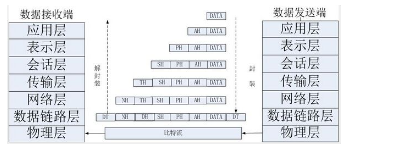
- 应用层报文被传送到运输层
- 在最简单的情况下，运输层收取到报文并附上附加信息，该首部将被接收端的运输层使用
- 应用层报文和运输层首部信息一道构成了运输层报文段，附加的信息可能包括：允许接收端运输层向上向适当的应用程序交付报文的信息以及差错检测位信息。该信息让接收端能够判断报文中的比特是否在途中已被改变
- 运输层则向网路层传递该报文段，网络层增加了如源和目的端的系统地址等网络层首部信息，生成了网络层数据报
- 网络层数据报接下来被传递给链路层，在数据链路层数据包添加发送MAC地址和接收端MAC地址后被封装成数据帧
- 在物理层数据帧被封装成比特流，之后通过传输介质传送到对端
- 对端再一步步解开封装，获取到传送的数据

# 如何理解TCP/IP协议？

## 什么是TCP/IP
TCP/IP，传输控制协议/网际协议，是指能在多个不同网络间实现信息传输的协议簇

- TCP（传输控制协议）

一种面向连接的、可靠的、基于字节流的传输层通信协议

- IP(网际协议)
用于封装交换数据的网络协议

TCP/IP协议不仅仅指的是TCP和IP两个协议，而是指一个由 FTP、SMTP、TCP、UDP、IP 等协议构成的协议簇

只是因为在TCP/IP协议中TCP和IP协议最具代表性，所以统称为TCP/IP协议簇

## 划分
