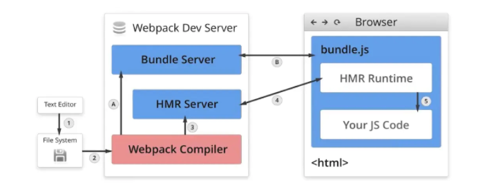

# webpack是什么？
## 背景
webpack最初的目标是实现前端项目的模块化，旨在更高效的管理和维护项目中的每一个资源

### 模块化
- 文件划分： 最早的时候我们通过文件划分的形式实现模块化，缺点：模块都是在全局中工作，大量模块成员污染了环境，模块与模块之间并没有依赖关系、维护困难、没有私有空间等问题
- 命名空间：规定每一个模块只暴露一个全局对象，然后所有模块都挂载到这个对象中，但这种方式仍然没有解决依赖以及重命名覆盖以及全局私有化的问题
- 立即执行函数，无法解决，模块加载的先后顺序问题
- commonJS规范、AMD规范、CMD规范、ESModule
  
## 问题
现代前端开发已经十分复杂，所以我们开发过程中会遇到以下问题：
- 需要通过模块化的方式进行开发
- 需要使用一些高级特性来加快我们的开发效率和安全性，比如通过ES6+、TypeScript开发脚本逻辑，通过less、sass等方式来编写css样式代码
- 监听文件的变化，并反映到浏览器上，提高开发的效率（热更新）
- js代码需要模块化，HTML和CSS这些资源也会面临需要模块化的问题
- 开发完成后我们还需要将代码进行压缩、合并以及其他相关优化

## 是什么？
webpack是一个用于现代JavaScript应用程序的静态模块打包工具
- 静态模块
这里的静态模块是指开发阶段，可以直接被webpack直接引用的资源，当webpack处理应用程序时，它会在内部构建一个依赖图，此依赖图对映射到项目所需的每个模块，并产生一个或多个bundle

## webpack的能力
- 编译代码能力
- 模块整合能力
- 万物皆可模块的能力
# webpack构建流程
 ## 运行流程
 webpack是基于js开发的一个打包工具，所以注定了他是以单线程为主的开发工具，所以他的运行流程是一个串行过程，他的工作就是各个插件串联起来

 在运行过程中会广播事件，插件只需监听它所关心的事件，就能加入到这条webpack机制中，去改变webpack的运作，使得整个系统扩展性良好

 从启动到结束会依次执行以下三大步骤：

 - 初始化流程：从配置文件和shell语句中读取与合并参数，并初始化使用的插件和配置插件等执行环境所需要的参数
 - 编译构建流程：从Entry发出，针对每个Module串行调用对应的loader去翻译文件内容，在找到该Module依赖的Module，递归的进行编译处理
 - 输出流程：对编译后的Module组合成Chunk，把Chunk转换成文件，输出到文件系统
# webpack中的loader解决了什么问题
## loader是什么
loader是对模块的"源代码"进行转换，在import或“加载”模块时预处理文件

webpack做的事情仅仅只是分析出各种模块的依赖关系，然后形成资源列表，最终打包生成到执行的文件中。

在webpack中，任何文件都是模块，不仅仅是js文件

默认情况下，在遇到import或者require加载模块的时候，webpack只支持对js和json文件打包

像css、less、png等这种类型的文件的时候，webpack则无能为力，这个时候就需要配置对应的loader文件内容的解析

当webpack碰到不识别的模块的时候，webpack会在配置中查找该文件的解析规则

关于配置loader的方式有三种：
- 配置方式（推荐）：webpack.config.js文件中指定loader
- 内联方式：在每个import语句中显示指定loader
- CLI方式：在shell命令中指定他们
## 配置方式
关于loader的配置，我们是写在 module.rules属性中，属性介绍如下：
- rules是一个数组形式，因此我们可以配置很多个loader
- 每一个loader对应一个对象形式，对象属性test为匹配规则，一般情况下为正则表达式
- 属性use针对匹配到文件类型，调用对应的loader进行处理

## 特性
- loader可以是同步的也可以是异步的
- loader运行在Node.js当中并且能够执行任何操作
- 除了常见的通过pack.json的main来将一个npm模块导出为loader，还可以在module.rules中使用loader字段直接引用一个模块
- 插件（plugin）可以为loader带来更多特性
- loader能够直接产生额外的任意文件
## 常见的loader
- style-loader：将css添加到DOM的内联样式标签style里
- css-loader:允许将css文件通过require的方式引入，并返回css代码
- less-loader：处理less
- sass-loader：处理sass
- postcss-loader：用postcss来处理css
- autoprefixer-loader：处理css3属性前缀，已经被弃用，建议直接使用postcss
- file-loader：分发文件到output目录并返回相对路径
- url-loader：和file-loader类似，但是当文件小于设定的limit时，可以返回一个Data Url
- html-minify-loader：压缩HTML
- babel-loader：用babel来转换ES6文件到ES5

# webpack中的Plugin
## Plugin是什么？
Plugin是一种计算机应用程序，它和主应用程序相互交互，以提供特定的功能

是一种遵循一定规范的应用程序接口编写出来的程序，只能运行在程序规定的系统下，因为其需要调用原纯净系统提供的函数库或数据    

webpack中的plugin也是如此, Plugin赋予其各种各样灵活的能力，例如打包优化、资源管理、环境变量注入等，他们会运行在webpack的不同阶段（钩子/生命周期），贯穿了webpack整个编译周期

其目的是为了解决loader无法解决的事情

## 特性
其本质是一个具有apply的方法的JavaScript对象

apply方法会被webpack compiler调用，并且在整个编译生命周期都可以访问compiler对象

compiler hook 的tap 方法的第一个参数，应当是驼峰式命名的插件名称

关于整个编译生命周期的钩子函数如下：

- entry-option：初始化option
- run
- compile：真正开始的编译，在创建compilation 对象之前
- compilation：生成好了compilation对象
- make：从entry开始递归分析依赖，准备对每个模块进行build
- after-compile：编译build过程结束
- emit：再将内存中assets内容写到磁盘文件夹之前
- after-emit：将内存中assets内容写到磁盘文件之后
- done：完成所有的编译过程
- failed：编译失败的时候
  
# plugin和loader的区别

## 作用不同
- loader是文件加载器，能够加载资源文件，并对这些文件进行一些处理，诸如编译、压缩等，最终一起打包到制定文件中
- plugin赋予了 webpack各种更加灵活的功能，例如打包优化、资源管理、环境变量注入等。目的是为了解决loader无法实现的一些问题
## 运行时机不同
- loader运行在打包文件之前
- plugins在整个编译过程中都起作用

# webpack热更新及其原理

## 热更新是什么？
HMR 全称 Hot Module Replacement，可以理解为模块热替换，指在应用程序运行过程中，替换、添加、删除模块而无需刷新整个应用

## 原理

- webpack Compile：将js代码编译成bundle.js
- HMR Server:用来将热更新的文件输出给HMR Runtime
- 